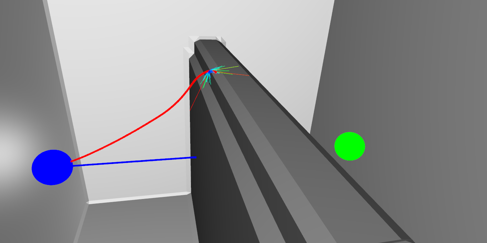

# Overview
This repository is used to train and evaluate learned planners in 3d. The code in this repository can roughly be divided into 3 parts: The planner and policies (a part of which is defined in the `rmpcpp_planner` and `rmpcpp` directories), the data pipeline and the learning infrastructure. 

## Known Issues
- The datapipeline is multiprocessed, so when setting num_workers > 0, it will spawn multiple copies across processes. The code for this has not been cleaned up yet properly, and also error handling is very bad. This means that exceptions in workers are often not properly caught and communicated, resulting in deadlocks during training if a worker were to fail. 
- Python imports are not really done in a disciplined manner, and there are still quite some unused imports after refactoring, so there may be a bunch of depencies that you need for parts of the code that should not be necessary there. Will clean that up one day.
- Extracting tarballs in the datapipeline can take forever. Should use a multithreaded tar version at some point
- Not really an issue, but quite important to know this; during a default DAgger training run there will be almost 1000GB of data created on disk. If you start different runs that end up on the same cluster node, you will likely take up all local storage, and the sysadmin will probably get mad at you and kill your jobs. So keep that in mind, and try to run things on different nodes.
- The figures used in the paper that use the randomly generated worlds are not correctly generated with this version of the code. This is because the world generation code has been changed, leading to different worlds for the same seeds. Only fix for this I think is to include an older version of the code as well which is not too nice. All other world plots should be reproducible though.

## Most important things
This project uses a lot of configuration files to set up networks, data pipelines, planner parameters, world definitions and a bunch of other things. These configuration files are located in the subfolders of the [configs](configs) directory. 

There are 3 subfolders, but more can be added if necessary: 
- default. Used only for non-training code.
- mini_config. Used for a mini training run.
- training. Used for full training runs. 

The default directory only contains 2 config files:
- General parameters, used for the parameters of mostly policies, and some other things.
- Probabilistic world parameters, used for the default definitions of some main world types (sphere box world, plane world).
The default directory is used by pretty much all non-training code (so mainly plotting code), and the parameters there basically never change. A lot of python default parameter classes take their data from these files.

The mini_config and training directories are used during training. You can select either of these config dirs by passing the corresponding --config_path to the [training script](python/rmp_dl/learning/train.py). You just need to select the name of the subfolder, so '--config_path mini_config' for the mini_config. You can also add any subfolder and pass it to the script. You just need to make sure that all the right config files are there: 

- General parameters, as described above, used by e.g. the rollouts during training.
- Probabilistic world parameters. Actually during training the definition of the worlds is used from the corresponding datapipeline file, so the predefined worlds are not really used, but you should still have this file, also because some references (explained below) may actually be used.

Then there should be 3 subdirectories, each containing possibly multiple config files. Similar to selecting e.g. the mini_config subfolder above, you can select the right config file contained in these subfolders by passing the correct string to the training script [parser](python/rmp_dl/learning/parser.py) (I'll give examples below). First I'll list the 3 subdirs
- Train dataset config. Contained in the `data_pipeline_config_train` subdir. Sets up the training data pipeline. 
- Validation dataset config. Contained in the `data_pipeline_config_validation` subdir. Sets up multiple validation datapipelines. 
- Model config. Contained in the `model_config` subdir. Builds up the model that is being trained.

So for a full overview, the tree looks like this:

├── default  
│   ├── general_config.yml  
│   └── probabilistic_worlds.yml  
├── mini_config  
│   ├── data_pipeline_config_train  
│   │   ├── dagger.yml  
│   │   └── dense.yml  
│   ├── data_pipeline_config_validation  
│   │   └── default.yml  
│   ├── general_config.yml  
│   ├── model_config    
│   │   ├── ffn.yml  
│   │   └── rnn.yml  
│   └── probabilistic_worlds.yml  
├── README.md  
└── training  
    ├── data_pipeline_config_train  
    │   ├── dagger.yml  
    │   ├── dense_inflated.yml  
    │   └── dense.yml  
    ├── data_pipeline_config_validation  
    │   └── default.yml  
    ├── general_config.yml  
    ├── model_config  
    │   ├── ffn.yml  
    │   └── rnn.yml  
    └── probabilistic_worlds.yml  
  
Some examples:

If you want to start a full FFN training run that uses the densely sampled dataset: 
```bash
python train.py --config_path training --train_dataset_config_name dense --validation_dataset_config_name default --model_config_name ffn
```
Similarly, for a mini training run you do the same thing, but just using `--config_path mini_config`. 

If you want to start a full RNN training run that uses DAgger:
```bash
python train.py --config_path training --train_dataset_config_name dagger --validation_dataset_config_name default --model_config_name rnn
```

Look at the config files themselves on good examples on how they are set up. Generally speaking, the model config gets progressively unpacked into the submodules of the [lightning module](python/rmp_dl/learning/lightning_module.py). The data pipeline configs contains a list of nodes, that get unpacked into the correct node by the [datapipeline](python/rmp_dl/learning/data/pipeline/data_pipeline.py). 

Notice that for training runs, there will always be 5 paramter files that need to be defined. These parameter files can reference other parameters to make usage easier: You can reference a parameter by using $param_file/path/to/parameter. These are the parameter file strings for the 5 parameter files as defined above:

```yaml
"general"
"model"
"datatrain"
"dataval"
"worlds"
```

So if you want to reference a parameter in a dictionary `foo` in `general_parameters.yml` with key stuff, you can do so by `$general/foo/stuff`. You can keep nesting this, or if stuff is a list, you can get e.g. the first element by `$general/foo/stuff/0` (and you can keep nesting this too). Note that you SHOULD NOT reference variables in other files from the general params file, as this is not supported in all parts of the code (some parts of the code expect `$general` to be self contained). Also you SHOULD NOT reference any variables from anything other than $general inside $worlds, because the non-training code only uses these 2 files, so it does not make sense to reference to training config files. 


The root learning module is the `RayLightningModule` in [python/rmp_dl/learning/lightning_module.py](python/rmp_dl/learning/lightning_module.py), and the other model parts are in the `model_parts` folder in that directory. The main entrypoints of scripts that you can call is the entry training script [train.py](python/rmp_dl/learning/train.py) in that same directory, and the 3d visualization scripts in [python/rmp_dl/vis3d/vis_scripts](python/rmp_dl/vis3d/vis_scripts). I'll give a more in-depth description of how to call these below. 


### Wandb Dependency
During training we have used weights and biases (Wandb) to monitor statistics, upload intermediate pictures of planning runs, etc. We strongly recommend also using wandb, but the training should still run fine without it (disable the wandb flag in train.py); printing a loss to the console and logging checkpoints on disk. 

## Structure
I'll give a short overview of some things are located.

- The C++ part of the planner and policies is defined in [../rmpcpp_planner](../rmpcpp_planner) and [../rmpcpp](../rmpcpp). 
- The Python bindings for these C++ classes and functions (and some nvblox interfacing bindings) are in [src/bindings](src/bindings). Follow the installation and build instructions in this Readme to compile those bindings such that they can be used in the Python scripts.
- The Python part of the planner and policies is defined in [python/rmp_dl/planner](python/rmp_dl/planner) and [python/rmp_dl/planner/policies](python/rmp_dl/planner/policies). Many of those use the C++ classes under the hood. 
- World generation files are in [python/rmp_dl/worldgenpy](python/rmp_dl/worldgenpy). These scripts also use some of the Python bindings to interface with nvblox.
- All learning infrastructure is in [python/rmp_dl/learning](python/rmp_dl/learning), including the datapipeline in [python/rmp_dl/learning/data/pipeline](python/rmp_dl/learning/data/pipeline). 
- The visualization scripts are in [python/rmp_dl/vis3d](python/rmp_dl/vis3d)
- The random world tester script is located in [python/rmp_dl/testing](python/rmp_dl/testing). This script is used to generate success rate figures, but requires a training run to be located on wandb to start the test run.
- The scripts used to start runs on slurm for training and testing runs are located in [misc/euler_scripts](misc/euler_scripts/)


## Running the 3D Visualization Scripts
As mentioned above, note that the visualizations that use the randomly generated worlds show something else than visualized in the paper. This is because the code generating the random worlds has changed, and thus results in a different world for the same seed compared to an older version of the code. I don't see a clean way to fix this, other than including the full old version of the code. The scripts that use real worlds or custom worlds show the same thing as in the paper. The models used are the same, so you can play around with different randomly generated worlds yourself.

The scripts are located under [python/rmp_dl/vis3d/vis_scripts](python/rmp_dl/vis3d/vis_scripts). The 'simple' file just generates the 3d live visualization (the other file programmatically creates pngs with e.g. colorbars.). 

I'll explain the 2nd function, called `ffn_stuck_wall`:

```Python
def ffn_stuck_wall():
    worldgen = CustomWorldgenFactory.Overhang()
    planner3dvis = Planner3dVis(worldgen, distancefield=False, initial_idx=181, initial_modifier=3)

    Planner3dVisFactory.add_simple_target_planner(planner3dvis, color=[0, 0, 1])

    model = ModelUtil.load_model("5msibfu3", "latest")
    model.set_output_decoder_from_factory("max_sum50_decoder")
    Planner3dVisFactory.add_learned_planner(planner3dvis, name="FFN",
                                            model=model, color=[1, 0, 0], 
                                            step_vis=True, ray_vis=True)
    
    planner3dvis.go()
```

This creates the following live visualization:



The first 2 lines create the world and set up the 3d visualizer. With the `distancefield` parameter you can turn on whether the geodesic field is shown. After that we add the simple target planner, and then a learned planner, before starting the visualization with planner3dvis.go(). The 3d visualizer can visualize different planners, and also supports 2 extra types of visualizations: Step visualizations and ray visualizations, which can be enabled on a per-planner basis. The step visualization shows 3 arrows: A red arrow for the prediction of the learned policy, a green arrow for the direct location to the goal, and a black arrow for the gradient of the geodesic field. The step can be moved along the trajectory with the arrow keys, and you can hold shift for bigger jumps. This is also what the `initial_idx` argument is for; it sets the initial step along the trajectory to visualize. 

The ray visualization can show multiple things. 

1. The rays that the system sees. 
3. The output prediction of the learned model. 
4. The output prediction of the learned model, with the recurrent state of the LSTM set to 0 (thus only works if you are visualizing an RNN)
5. The difference between 4 and 3, basically showing what the LSTM is changing about our output. 

You can cycle through these, and some more (there are some more options in the code for certain cases), by hitting spacebar, where step 0 shows nothing. This is what the `initial_modifier` argument is for; it sets the initial ray visualization type. The ray visualization also moves along by hitting the arrow keys, at the same location as the step visualization. 

The plotter also supports live changing of parameters that trigger a replan. Useful for tuning policies. Works well for the baseline planner, as that can plan in ~50ms. The learned planners are too slow to make this too useful. See the factory methods in `Planner3dVisFactory` and the `key_replan_parameter_changes` list for a bunch of examples, and see the comments in `Planner3dVis.add_planner` for more information. 

Other keyboard shortcuts are:

- 'W' toggles hiding the world
- 'G' toggles hiding the geodesic field
- 'T' toggles hiding the trajectories

## Starting a (mini) training run.
Calling `python python/rmp_dl/learning/train.py` will use the parser default args, will start a training script that uses the parameters from [configs/mini_config](configs/mini_config/). This is a mini DAgger training run, which will likely result in a lot of overfitting, but useful to test if everything works, and checkout the run (possible in wandb if configured.)

For a full training run change the --config-path to the training config directory in the `parser.py` file. Full training runs require a lot of resources, and it is recommended that it is started with e.g. 10 workers on a large GPU. 


## Starting Test Runs
Test runs are started from [misc/euler_scripts/submit_test.sh](misc/euler_scripts/submit_test.sh). In this script you can set the world type (planes or sphere box), experiment type (are we doing expert, baseline or learned), and then some options for the learned systems: You give the wandb id of the system you are testing, and the decoder type. The decoder type is basically a string the sets the value for $k in the max k decoder strategy. The string has to be defined in the `Halton2dDecoderFactory.resolve_decoder` method: 

```Python
class Halton2dDecoderFactory:
    @staticmethod
    def resolve_decoder(method: str, n: int):
        if method == "max_decoder":
            return Halton2dDecoder(n=n, method="max", method_parameters={"k": 1})
        elif method == "max_sum10_decoder":
            return Halton2dDecoder(n=n, method="max", method_parameters={"k": 10})
        elif method == "max_sum50_decoder":
            return Halton2dDecoder(n=n, method="max", method_parameters={"k": 50})
        elif method == "max_sum100_decoder":
            return Halton2dDecoder(n=n, method="max", method_parameters={"k": 100})
        elif method == "max_sum512_decoder":
            return Halton2dDecoder(n=n, method="max", method_parameters={"k": 512})
        elif method == "max_sum1024_decoder":
            return Halton2dDecoder(n=n, method="max", method_parameters={"k": 1024})
```

You can submit a test run by calling `sbatch < submit_test.sh` on euler. 

# Things 

- The flatten node in the datapipeline has 2 modes: sequenced or non-sequenced. 
- Make sure to never set any state in constructors of pipeline objects that uses the seed to set that state (e.g. initializing random engines, or sampling classes). Do this during calls to setup(), as only at this point will multiprocessed workers be instantiated, and the seed attribute will be uniquely set for different workers in the PipelineObjectBase class.  
- The raycasting cuda obstacle avoidance policy parameters in general_parameters.yml also contains a so-called 'geodesic' variant. This was originally for the expert policy, as you need less strong obstacle avoidance if you're always going the right way. I also wanted to use it for the learned policy, but decided not to as the learned policy can still go into obstacles so it is safer to use a more conservative raycast avoidance policy. 
- The integration speeds when doing the visualizations and stuff are quite low, this is because of saving intermediate observations etc. 

